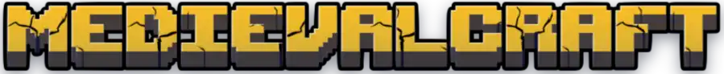

<div align="center">
  

[](https://react.dev/)
[](https://www.typescriptlang.org/)
[](https://vitejs.dev/)
[](https://tailwindcss.com/)
[](https://netlify.com/)

</div>

## 🌐 **Demo**

**🔗 URL**: [medievalcraft.netlify.app](https://medievalcraft.netlify.app)

Una experiencia completa de servidor Minecraft medieval con diseño moderno, animaciones fluidas y optimizaciones de performance avanzadas.

---

## 🚀 **Instalación Rápida**

```bash
# Clonar el repositorio
git clone https://github.com/tu-usuario/medievalcraft-web.git

# Entrar al directorio
cd medievalcraft-web

# Instalar dependencias
npm install

# Ejecutar en desarrollo
npm run dev

# Build para producción
npm run build

# Preview del build
npm run preview
```

---

## 📁 **Estructura del Proyecto**

```
src/
├── components/
│   ├── ui/           # Componentes base (Button, Card, ServerStatus)
│   ├── common/       # Header, Footer con navegación responsiva
│   └── sections/     # Secciones específicas de cada página
├── pages/           # Páginas principales del sitio
├── data/            # Datos estáticos de reinos y productos
├── styles/          # CSS global y configuración Tailwind
└── assets/          # Fuentes Minecraft y recursos estáticos
```

---

## 🛠️ **Tecnologías**

### 🔧 **Frontend Core**

- **React 19** con características concurrentes y Suspense
- **TypeScript** para tipado estático robusto y mejor DX
- **Vite** con chunking manual optimizado y HMR ultra-rápido

---

## 🎨 **Paleta de Colores**

| Color                | Hex       | Uso                               |
| -------------------- | --------- | --------------------------------- |
| **🟡 Accent Gold**   | `#D4AF37` | Títulos principales, botones CTA  |
| **🟤 Accent Dark**   | `#B8941F` | Subtítulos, elementos secundarios |
| **⚫ Medieval Dark** | `#0F172A` | Fondos principales                |
| **🔵 Steel Blue**    | `#334155` | Componentes, borders              |

---

## 🙏 **Créditos y Reconocimientos**

### 🖼️ **Assets e Imágenes**

- **Texturas medievales e imágenes épicas**: [Planet Minecraft](https://www.planetminecraft.com/)

### 🔤 **Tipografía**

- **Minecraft Font (MinecraftTen)**: [CDN Fonts](https://www.cdnfonts.com/minecraft-4.font)

### 👨‍💻 **Desarrollo**

- **Desarrollado por**: **Harold Ponce**
- **Portfolio**: [haroldev.netlify.app](https://haroldev.netlify.app)
- **LinkedIn**: [Harold Ponce](https://www.linkedin.com/in/harold-ponce-234897285/)

---

## 📜 **Licencia**

Este proyecto es de **código abierto** para fines educativos y de portfolio.

- ✅ **Libre para uso educativo** y aprendizaje
- ✅ **Código fuente disponible** para referencia
- ⚠️ **Assets visuales** pertenecen a sus respectivos creadores en Planet Minecraft
- 📝 **Font license** según términos de CDN Fonts

---

<div align="center">
    
  **🔗 [Visitar MedievalCraft](https://medievalcraft.netlify.app) | 💼 [Portfolio](https://www.linkedin.com/in/harold-ponce-234897285/)**
  
  ---
  
  *Hecho con ❤️ y mucho ☕ por Harold Ponce*
  
</div>
